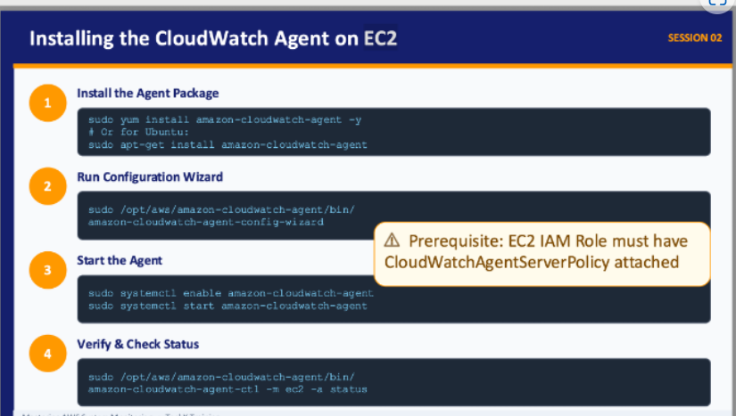
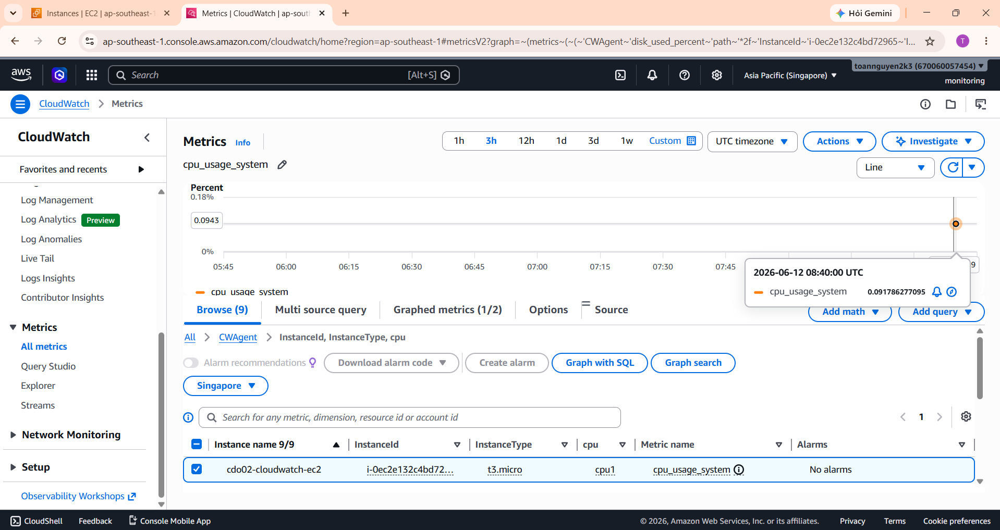
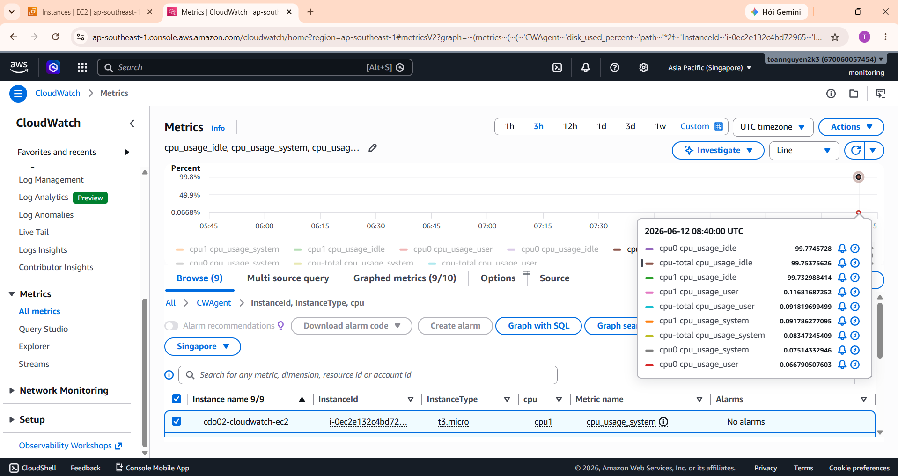

# CloudWatch Agent on EC2 with Terraform

This project provisions a complete AWS lab environment for installing and validating the Amazon CloudWatch Agent on EC2. The infrastructure is created with Terraform and uses a custom VPC, custom subnet, custom security group, and EC2 access through AWS Systems Manager instead of SSH.

## Assignment Reference

The original assignment focuses on four core steps: install the CloudWatch Agent package, run the configuration wizard, start the agent, and verify its status.



## Project Scope

This project implements the assignment with the following design decisions:

- Terraform-managed infrastructure
- Custom VPC, subnet, route table, and security group
- No use of default VPC resources
- EC2 management through SSM Session Manager
- IAM role attached to EC2 with the required CloudWatch and SSM permissions
- CloudWatch Agent installed and configured on the EC2 instance

## Architecture

The deployed environment includes:

- 1 VPC
- 1 public subnet
- 1 Internet Gateway
- 1 public route table and route table association
- 1 security group with no inbound SSH rule
- 1 EC2 IAM role
- 1 EC2 instance profile
- 1 Amazon Linux 2023 EC2 instance

## IAM Permissions

The EC2 instance role includes:

- `AmazonSSMManagedInstanceCore`
- `CloudWatchAgentServerPolicy`

These policies are required for:

- SSM access without SSH
- CloudWatch Agent metric and log delivery

## Terraform Files

- [provider.tf](provider.tf)
- [variables.tf](variables.tf)
- [main.tf](main.tf)
- [network.tf](network.tf)
- [iam.tf](iam.tf)
- [ec2.tf](ec2.tf)
- [outputs.tf](outputs.tf)

## How to Use

```powershell
Copy-Item terraform.tfvars.example terraform.tfvars
terraform init
terraform fmt
terraform validate
terraform plan
terraform apply
```

## Current Deployment Result

The environment has already been deployed successfully in `ap-southeast-1`.

- VPC: `vpc-0eb8db1f5c2076800`
- Subnet: `subnet-005900141eae51bdb`
- Security Group: `sg-0ec572334e91ff4eb`
- EC2 Instance: `i-0ec2e132c4bd72965`
- IAM Role: `cdo02-cloudwatch-ec2-role`

## Connect to the Instance

Use SSM Session Manager:

```powershell
aws ssm start-session --target i-0ec2e132c4bd72965 --region ap-southeast-1
```

## CloudWatch Agent Status

The CloudWatch Agent has been installed, enabled, and confirmed as running.

Status result:

```json
{
  "status": "running",
  "starttime": "2026-06-12T08:42:16+00:00",
  "configstatus": "configured",
  "version": "1.300066.2"
}
```

To verify again from the instance:

```bash
sudo /opt/aws/amazon-cloudwatch-agent/bin/amazon-cloudwatch-agent-ctl -m ec2 -a status
```

## Suggested Screenshots

For a clean project submission, capture:

- `terraform apply` success output
- EC2 instance in `Running` state
- Custom VPC
- Custom subnet and route table
- Custom security group
- IAM role with attached policies
- SSM managed instance status as `Online`
- SSM terminal session
- CloudWatch log group
- CloudWatch metrics
- CloudWatch Agent status output

## Console Screenshots

### CloudWatch Metrics

The screenshots below show CloudWatch Agent metrics being collected successfully from the EC2 instance.





## Notes

- The environment uses a public subnet only to keep the lab simple and cost-efficient.
- SSH is not required.
- The project is designed to match the assignment while following a cleaner infrastructure setup than the default AWS network.
